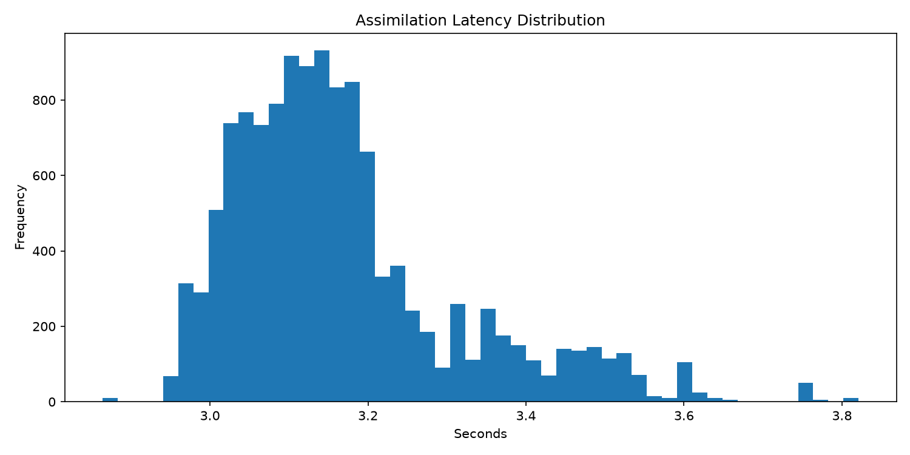
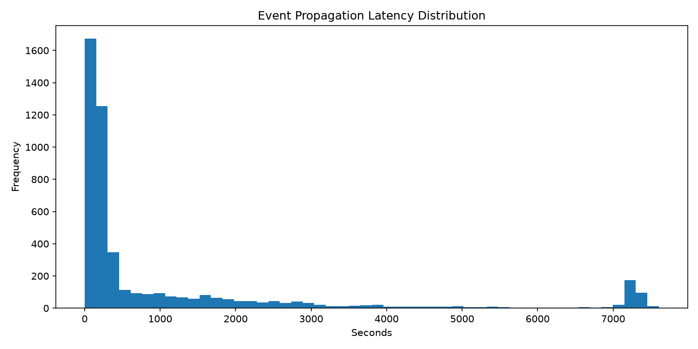
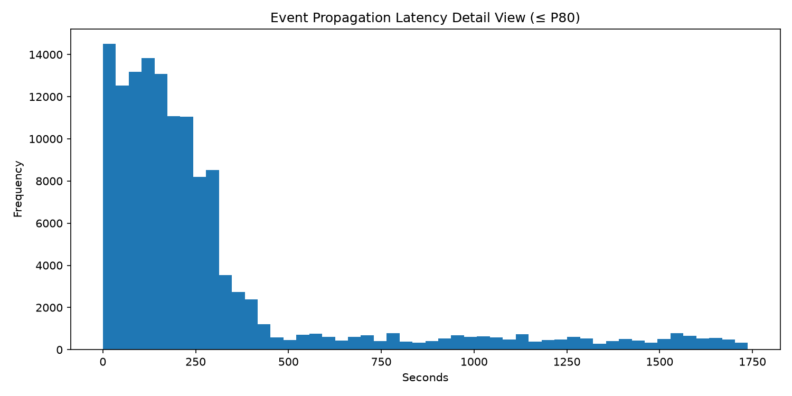
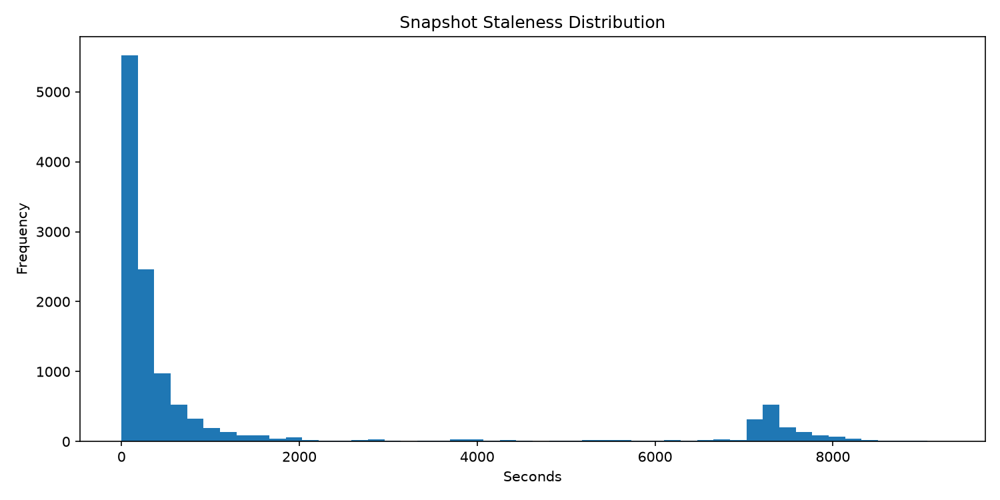
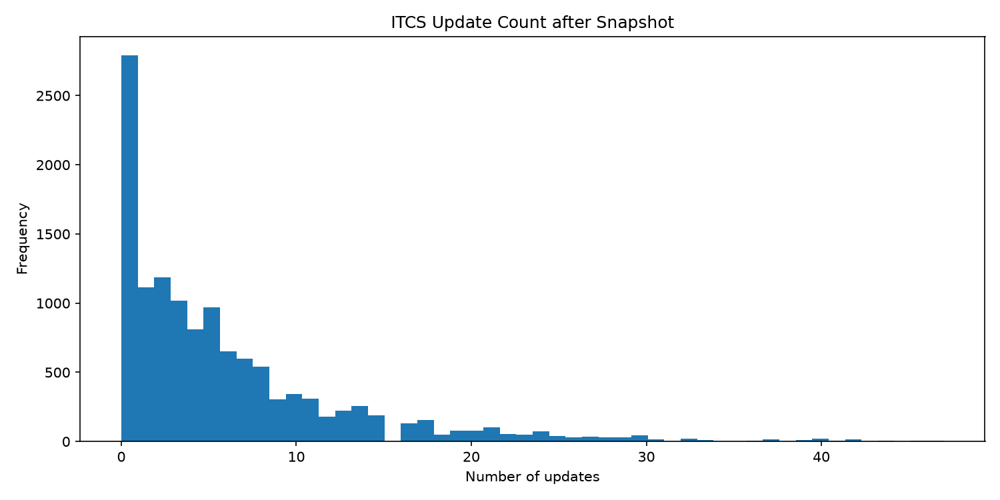

# SIRI / ITCS Temporal Analysis Report

Generated: 2026-06-13 20:56:52 UTC

## 1. Study Design and Data Scope
This report evaluates temporal characteristics of real-time public transport information flows between an ITCS source system and SIRI-ET snapshots.

Observation window: 2026-06-13T07:49:59.042000+00:00 → 2026-06-13T15:58:06.335000+00:00
Number of SIRI snapshots analysed: 486
Number of journey observations analysed: 444306

## 2. Assimilation Latency

Assimilation latency measures the temporal distance between the latest ITCS update and the corresponding SIRI RecordedAtTime timestamp. It approximates internal processing and data ingestion latency within the ET generation chain.

### Statistical Summary
- Sample Count: 12606
- Mean: 3.168 s
- Standard Deviation: 0.146 s
- Maximum: 3.821 s

### Quantiles
- P50: 3.136 s
- P60: 3.165 s
- P70: 3.196 s
- P80: 3.254 s
- P90: 3.384 s
- P95: 3.485 s
- P99: 3.593 s

### Distribution

## 3. Event Propagation Latency

Event propagation latency measures the delay between an ITCS event occurrence and the first SIRI snapshot in which that event becomes externally visible. This metric represents the effective end-to-end propagation delay experienced by consumers.

### Statistical Summary
- Sample Count: 169345
- Mean: 1139.521 s
- Standard Deviation: 1977.900 s
- Maximum: 11149.042 s

### Quantiles
- P50: 230.999 s
- P60: 291.435 s
- P70: 598.509 s
- P80: 1737.803 s
- P90: 3930.068 s
- P95: 7189.251 s
- P99: 7385.531 s

### Distribution

## 4. Snapshot Staleness

Snapshot staleness quantifies the age of information at the moment of publication. It is calculated as the difference between ResponseTimestamp and RecordedAtTime.

### Statistical Summary
- Sample Count: 12606
- Mean: 1365.235 s
- Standard Deviation: 2509.331 s
- Maximum: 10223.396 s

### Quantiles
- P50: 229.417 s
- P60: 326.443 s
- P70: 512.028 s
- P80: 1127.194 s
- P90: 7203.185 s
- P95: 7446.132 s
- P99: 8184.598 s

### Distribution

## 5. Post-Snapshot ITCS Update Activity

This metric quantifies how many ITCS updates occurred after a snapshot was published. High values indicate that additional state changes became available shortly after publication.

- Mean number of updates: 5.856
- Maximum number of updates: 47

## 6. Interpretation

The presented metrics separate different stages of temporal behaviour within the real-time information pipeline.

- Assimilation latency characterises ingestion and processing delays.
- Event propagation latency characterises externally observable responsiveness.
- Snapshot staleness characterises information freshness at publication time.
- Post-snapshot update activity characterises remaining system dynamics after dissemination.

Together, these measures provide a decomposition of real-time system behaviour that can be used to identify bottlenecks and evaluate service quality.

## Appendix A: Complete Quantile Summary

### Assimilation Latency
- Sample Count: 12606
- Mean: 3.168
- StdDev: 0.146
- P50: 3.136
- P60: 3.165
- P70: 3.196
- P80: 3.254
- P90: 3.384
- P95: 3.485
- P99: 3.593
- Max: 3.821

### Event Propagation Latency
- Sample Count: 169345
- Mean: 1139.521
- StdDev: 1977.900
- P50: 230.999
- P60: 291.435
- P70: 598.509
- P80: 1737.803
- P90: 3930.068
- P95: 7189.251
- P99: 7385.531
- Max: 11149.042

### Snapshot Staleness
- Sample Count: 12606
- Mean: 1365.235
- StdDev: 2509.331
- P50: 229.417
- P60: 326.443
- P70: 512.028
- P80: 1127.194
- P90: 7203.185
- P95: 7446.132
- P99: 8184.598
- Max: 10223.396
