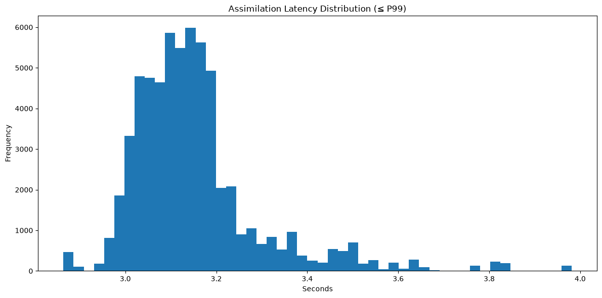
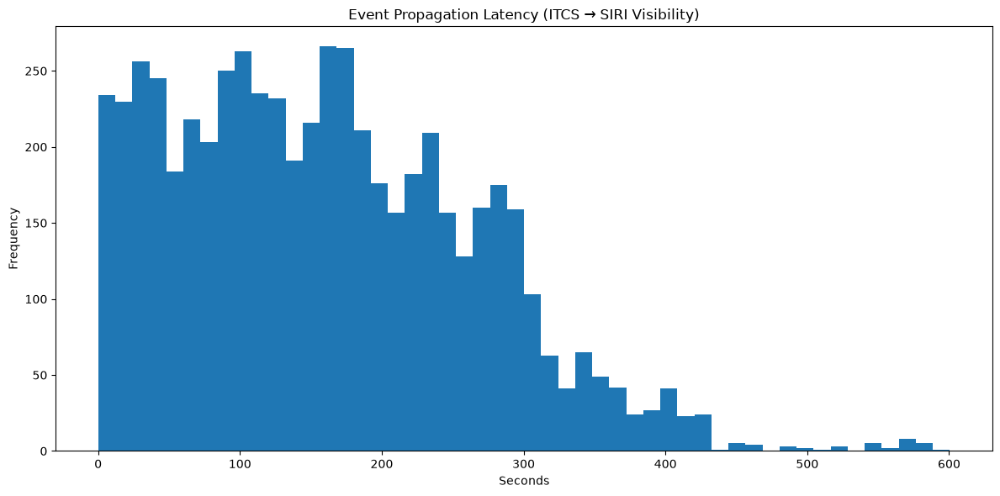
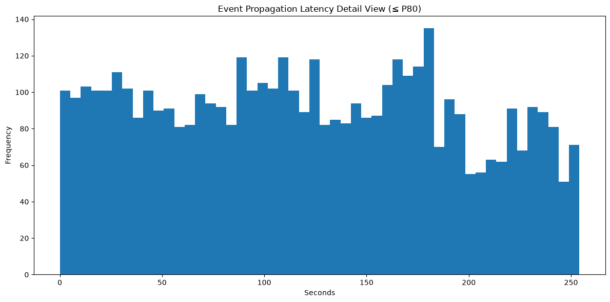
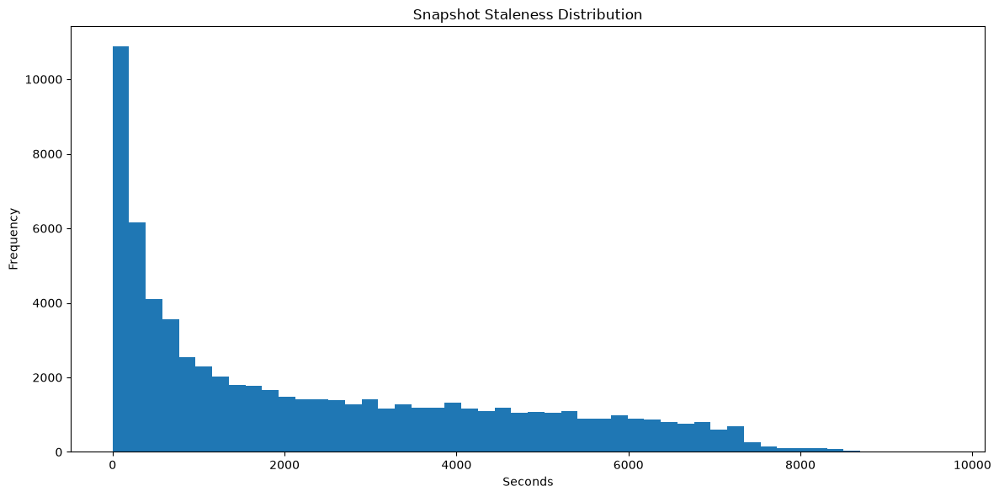
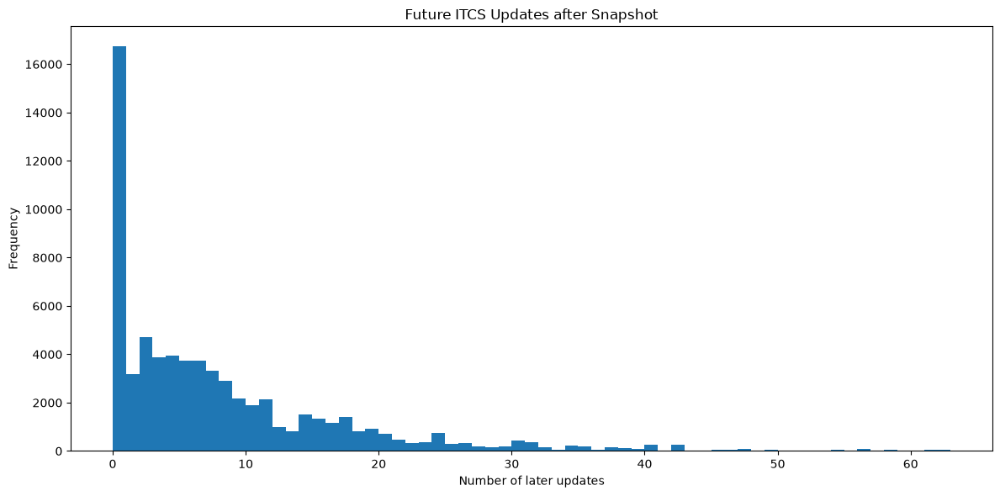
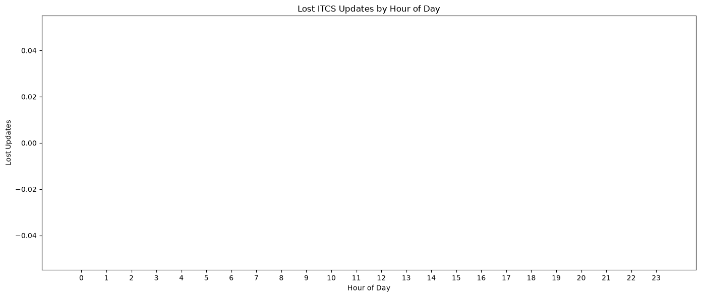

# SIRI-ET Compare
This Jupyter Notebook compares the data quality of DELFI SIRI-ET stream with the original communication logs of an ITCS of IVU. It requires two input files:
- `data/itcs.log` The communication logs of the IVU ITCS
- `data/siriet/*.xml` At least one recorded SIRI-ET dump of DELFI

## 1. Step: Extraction of ITCS Data
The ITCS log contains mixed text block logs and XML dumps of the VDV454-AUS data. The extraction block parses the XML contents and builds a dict in following structure:

```python
{
    'JourneyRef': [
        datetime(...),
        datetime(...),
        datetime(...),
        ...
    ]
}
```

This structure contains each journey and all timestamps, when data have been delivered for this journey.

    Number of unique journeys: 759
    Number of timestamp records: 7464
    

## 2. Step: Extraction of SIRI-ET Data
The SIRI-ET dumps contain a SIRI ServiceDelivery object. The extraction block parses the XMLs and extracts for each JourneyRef the RecordedAt timestamp into a structure like that:

```python
{
    'JourneyRef': {
        'response_timestamp': datetime(...),'
        'recorded_at': datetime(...)
    }        
    ...
}
```
The `recorded_at` is the timestamp when the message from the ITCS has arrived at the SIRI-ET broker. The `response_timestamp` represents the timestamp, when the updates became published in the SIRI-ET data.

    Found 486 SIRI-ET files to process.
    Processed 1/486 files (0.2%)
    Processed 100/486 files (20.6%)
    Processed 200/486 files (41.2%)
    Processed 300/486 files (61.7%)
    Processed 400/486 files (82.3%)
    Processed 486/486 files (100.0%)
    
    Analysis window: 2026-06-13T07:49:59.042000+00:00 to 2026-06-13T15:58:06.335000+00:00
    Number of SIRI snapshots: 486
    Number of unique SIRI journeys: 19,010
    Number of journeys from ITCS: 580
    Number of ITCS journeys not present in SIRI: 179
    Number of observations: 2,200,020
    

## 3. Step: Metrics
Out of the collected data, following metrics are calculated:
- Assimilation Latency: This is the time which an ITCS update takes to be recorded by the SIRI-ET sink. It is **not** the time when the update becomes visible!
- Propagation Latency: This is the time range which an ITCS updates takes to be visible in SIRI-ET data.
- Snapshot Staleness: Difference between `ResponseTimestamp` and `RecordedAt` of a journey in a SIRI-ET snapshot.
- Future ITCS Updates: Number of updates the ITCS has sent after the last publication of a journey in a SIRI-ET snapshot.
- Lost ITCS Updates: Number of updates the ITCS has sent, but never appeared in a SIRI-ET snapshot.

    
    ## Results
    Matched observations: 68118
    
    ## Assimilation Latency (ITCS → SIRI Data Sink)
    - Mean    : 3.152 s
    - StdDev  : 0.145 s
    - Max     : 3.981 s
    - P50     : 3.128 s
    - P60     : 3.152 s
    - P70     : 3.173 s
    - P80     : 3.207 s
    - P90     : 3.322 s
    - P95     : 3.459 s
    - P99     : 3.773 s
    - Samples : 62330
    
    ## Propagation Latency (ITCS → SIRI Visibility)
    - Mean    : 160.551 s
    - StdDev  : 104.900 s
    - Max     : 600.527 s
    - P50     : 151.671 s
    - P60     : 179.101 s
    - P70     : 216.049 s
    - P80     : 254.101 s
    - P90     : 299.101 s
    - P95     : 342.827 s
    - P99     : 422.904 s
    - Samples : 5744
    
    ## Snapshot Staleness
    - Mean    : 2361.295 s
    - StdDev  : 2219.314 s
    - Max     : 9662.466 s
    - P50     : 1614.688 s
    - P60     : 2471.655 s
    - P70     : 3481.209 s
    - P80     : 4584.627 s
    - P90     : 5890.771 s
    - P95     : 6639.136 s
    - P99     : 7492.840 s
    - Samples : 68118
    
    ## Future ITCS Updates
    - Mean : 7.829
    - Max  : 62
    
    ## Lost ITCS Updates
    - Total ITCS updates  : 5,744
    - Propagated updates  : 5,744
    - Lost updates        : 0
    - Loss rate (updates) : 0.0000 %
    
    ## Lost ITCS Journeys
    - Total ITCS journeys : 580
    - Propagated journeys : 580
    - Lost journeys       : 0
    Loss rate (journeys): 0.0000 %
    
    


    

    


    

    


    

    


    

    


    

    


    

    

